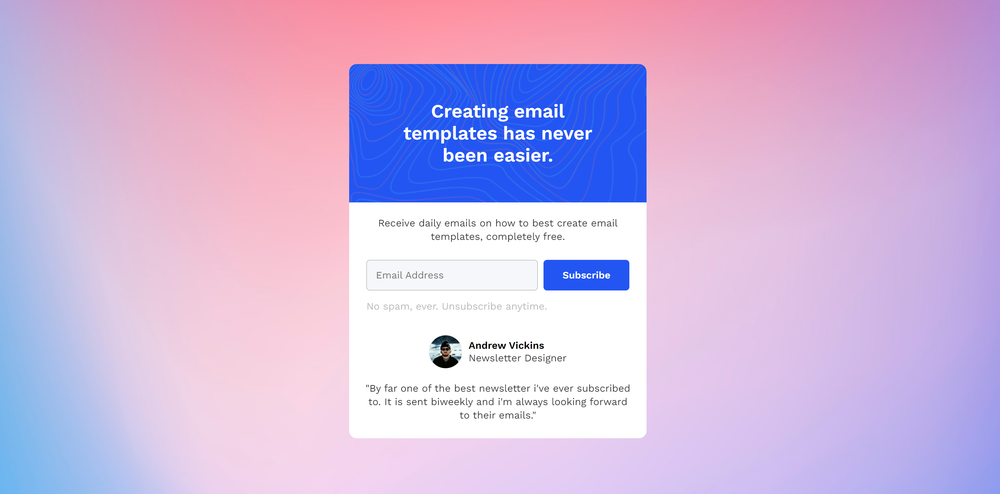

# Newsletter Popup Template - Codewell Challenge

This is a solution to the [Newsletter Popup Template Challenge on Codewell](https://www.codewell.cc/challenges/newsletter-popup-template--60a8db35203a0e6180bb5035).

Codewell's aim is to provide you with real-world design templates that you can use to practice your HTML and CSS projects.

## Table of contents

- [Overview](#overview)
  - [Screenshot](#screenshot)
  - [Links](#links)
- [My process](#my-process)
  - [Built with](#built-with)
  - [What I learned](#what-i-learned)
  - [Fonts Used](#fonts-used)

## Overview

### Screenshot

### Links

- Solution URL: [https://github.com/ShrutiShinde418/newsletter-popup](https://github.com/ShrutiShinde418/newsletter-popup)
- Live Site URL: [https://shrutishinde418.github.io/newsletter-popup/](https://shrutishinde418.github.io/newsletter-popup)

## My process

### Built with

- CSS Grid
- SASS
- Semantic HTML

### What I learned

- SASS Partials for modularizing the code
- How to use mixins

### Fonts Used

https://fonts.google.com/specimen/Work+Sans
